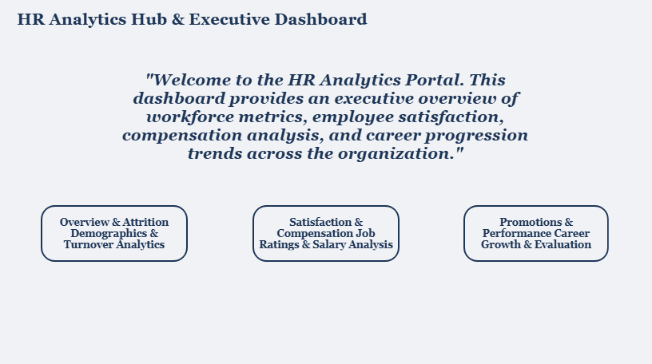

# 📊 HR Analytics Power BI Dashboard

An interactive 4-page Power BI dashboard engineered to deliver actionable insights into employee retention, compensation equity, and promotion bottlenecks.

---

## 📸 Dashboard Overview

---

## 🛠️ Key Highlights & Tech Stack
* **Power Query:** Preprocessed raw HR data, resolved missing values, and created custom tenure and age group conditional columns.
* **DAX Expressions:** Built explicit measures for Attrition Rate, Avg Promotion Delay, Performance Ratings, and Employee Counts.
* **UI/UX Design:** Designed a cohesive Navy & Coral high-contrast layout with bookmark-driven dynamic navigation.

---

## 📌 Analytical Modules
* **Home Page:** Central hub for navigation across report sections.
* **HR Attrition & Analytics:** Deep dive into turnover risks, age distributions, and high-risk department patterns.
* **Satisfaction & Compensation:** Evaluated relationships between monthly income, job involvement, and performance ratings.
* **Promotions & Performance:** Tracked promotion delays versus targets using custom KPI Gauge visualisations and Area Charts.

---

## 📁 Repository Files
* `Project2.pbix` — Complete Power BI Report
* `HR_Analytics.csv` — Primary Dataset
* `Home.png`, `sec.png`, `first.png`, `schema.png`, `trd.png` — Dashboard Visuals
